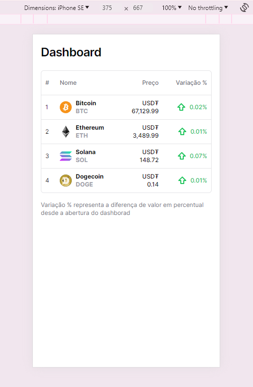
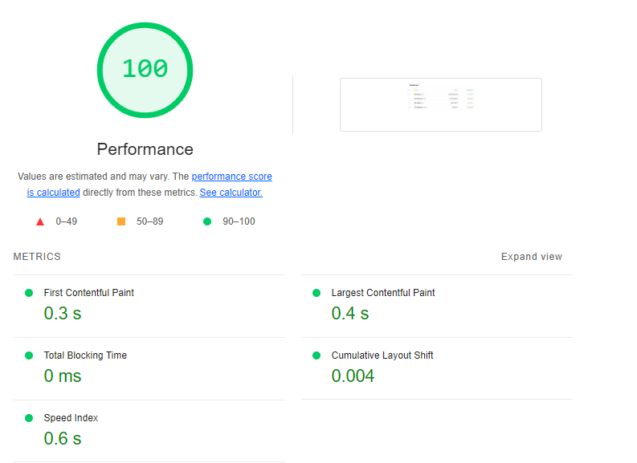
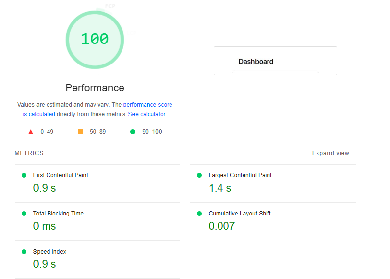

# Crypto Market Tracker

Essa é uma aplicação web com o objetivo de rastrear a capitalização de criptomoedas, se conectando a API da Binance para monitorar e exibir em tempo real o último preço e a flutuação percentual dos valores de criptomoedas.

## Funcionalidades do Dashboard

- Exibir o último preço em USDT para cada uma das criptomoedas. [Bitcoin, Ethereum, Solana e Dogecoin]
- Calcular e mostrar o percentual de mudança do preço desde a abertura do
  dashboard para cada criptomoeda.
- Atualizar estes dados em tempo real conforme as novas informações são recebidas
  via Websocket.

## Lógica da Aplicação
A lógica principal da aplicação é dividida em três partes: configurar a conexão WebSocket, processar os dados recebidos do WebSocket e criar/modelar os dados para a criação da tabela que exibe as informações das criptomoedas.

#### 1. Conexão WebSocket
A conexão WebSocket é configurada usando o hook `useBinanceMultipleStream`.
Este hook recebe um array de pares de criptomoedas como argumento e estabelece uma conexão WebSocket.

```
const { cryptoCurrencyDataStream }: { cryptoCurrencyDataStream?: CryptoCurrencyDataStreamProps } =
    useBinanceMultipleStream(cryptoCurrencyPairs);
```

#### 2. Processamento de Dados
Os dados recebidos do WebSocket são processados usando a função `useCryptoCurrencyData`. Esta função recebe o fluxo de dados do WebSocket e o array de pares de criptomoedas como argumentos. Ela usa a função `useCryptoCurrencyValue` para calcular o valor atual e a variação percentual para cada par de criptomoedas.

```
const { currentValues, percentageChange } = useCryptoCurrencyValue(
    cryptoCurrencyDataStream,
    cryptoCurrencyPairs,
);
```

#### 3. Criação da tabela
Os dados para a tabela que exibe as informações da criptomoeda são criados usando a função `createCryptoCurrencyTableData`. Esta função recebe os valores atuais e as variações percentuais para os pares de criptomoedas (em `cryptoCurrencyData`) e o array de pares de criptomoedas em (`cryptoCurrencyPairs`) como argumentos. Ela retorna um array de objetos, cada um contendo o rank, nome, valor atual e variação percentual de um par de criptomoedas.

```
const data = createCryptoCurrencyTableData(cryptoCurrencyData, cryptoCurrencyPairs);
```

Estes dados são então passados para a função `useReactTable` para criar a tabela.

```
const table = useReactTable({
    data,
    columns,
    getCoreRowModel: getCoreRowModel(),
});
```

### Preview



## Como executar o projeto

### Pré-requisitos

Antes de começar, você vai precisar ter instalado em sua máquina as seguintes ferramentas:
[Git](https://git-scm.com), [Node.js](https://nodejs.org/en/).
Além disto é bom ter um editor para trabalhar com o código como [VSCode](https://code.visualstudio.com/)

#### 🧭 Rodando a aplicação web (Frontend)

```bash

# Clone este repositório
$ git clone git@github.com:mateusbirtann/crypto-market-tracker.git

# Acesse a pasta do projeto no seu terminal/cmd
$ cd crypto-market-tracker

# Instale as dependências
$ pnpm install

# Execute a aplicação em modo de desenvolvimento
$ pnpm run dev

# Cria o bundle para publicação
$ pnpm run build

# Execute a aplicação em modo de produção
$ pnpm run start

# Executa o conjunto de testes disponível na aplicação
$ pnpm run test


# A aplicação será aberta na porta:3000/ em desenvolvimento e produção. Acesse http://localhost:3000/
```

---

## 🛠 Estrutura de pastas

```
project/
├── app/
├── components/
├── data/
├── hooks/
├── schema/
├── sections/
├── services/
├── types/
└── other_files/
```

- app/: A estrutura App Router é a versão mais recente que permite usar os novos recursos do Next/React, como server componentes e streaming.
- components/: Contém componentes reutilizáveis ​​que são usados ​​em várias partes do aplicativo
- hooks/: Contém hooks personalizados, que são funções reutilizáveis que encapsulam lógica comum (gerenciamento de estado, integração com APIs externas) para serem usadas em vários componentes do aplicativo.
- services/: Contém serviços fornecem funcionalidades específicas para o aplicativo. Isso pode incluir serviços de integração com APIs externas, serviços de armazenamento em cache, serviços de autenticação, etc.
- interfaces/: Contém definições de tipos de dados personalizados usados ​​no aplicativo. Essas definições ajudam a garantir a consistência e a precisão dos dados manipulados pelo aplicativo, além de facilitar o desenvolvimento, fornecendo informações sobre a estrutura dos objetos de dados.
- lib/: Contém bibliotecas de código que são usadas em todo o aplicativo. Estas podem ser bibliotecas de terceiros ou bibliotecas personalizadas desenvolvidas especificamente para este projeto.
- store/: Este diretório é geralmente usado em aplicações que utilizam gerenciamento de estado, como Redux nesse caso.

## 🛠 Tecnologias

As seguintes ferramentas foram usadas na construção do projeto, incluindo testes e setup.

#### **Website**

- **[Next.js](https://nextjs.org/)** - Framework React para renderização do lado do servidor e geração de sites estáticos.
- **[Tailwind](https://tailwindcss.com/)** - Estrutura CSS de baixo nível que permite estilo direto na marcação.
- **[Eslint](https://eslint.org/)** - Ferramenta de linting que ajuda a detectar erros e problemas no código.
- **[Typescript](https://www.typescriptlang.org/)** - Superconjunto de JavaScript que adiciona tipagem estática e outros recursos.
- **[Jest](https://jestjs.io/pt-BR/)** - Framework de teste em JavaScript para testes unitários, integração e snapshot.
- **[React Redux](https://react-redux.js.org/)** - Biblioteca oficial de integração do Redux com o React.
- **[Prettier](https://prettier.io/)** - Ferramenta de formatação de código que ajuda a manter um estilo consistente e legível.
- **[Lucide React](https://lucide.dev/)** - Conjunto de ícones leves e personalizáveis para projetos React.

## Testes

No arquivo `home.test.tsx`, temos um exemplo de como o estado da aplicação pode ser testado. Utilizamos a função addCryptoData para adicionar dados de criptomoedas ao estado e a função calculatePercentageChange para calcular a variação percentual. Em seguida, verificamos se o estado foi atualizado corretamente.

```
dispatch(addCryptoData({ name: 'btcusdt', value: '100' }));
dispatch(addCryptoData({ name: 'btcusdt', value: '150' }));

dispatch(addCryptoData({ name: 'ethusdt', value: '100' }));
dispatch(addCryptoData({ name: 'ethusdt', value: '150' }));

dispatch(calculatePercentageChange());

expect(store.getState().cryptoCurrency).toEqual({
  firstValues: { btcusdt: '100', ethusdt: '100' },
  currentValues: { btcusdt: '150', ethusdt: '150' },
  percentageChange: { btcusdt: 0.5, ethusdt: 0.5 },
});
```

No arquivo `table.test.tsx`, verificamos se o header e body são renderizados corretamente com os devidos valores passados.

## ⚡ Performance

Utilizando a ferramenta [Lighthouse](https://developers.google.com/web/tools/lighthouse), podemos avaliar e melhorar a qualidade da nossa aplicação web. O Lighthouse é uma ferramenta open-source automatizada que audita a performance, acessibilidade, práticas progressivas da web, SEO e mais.

Aqui estão os resultados do Lighthouse na última versão do projeto:

### Desktop



### Mobile


